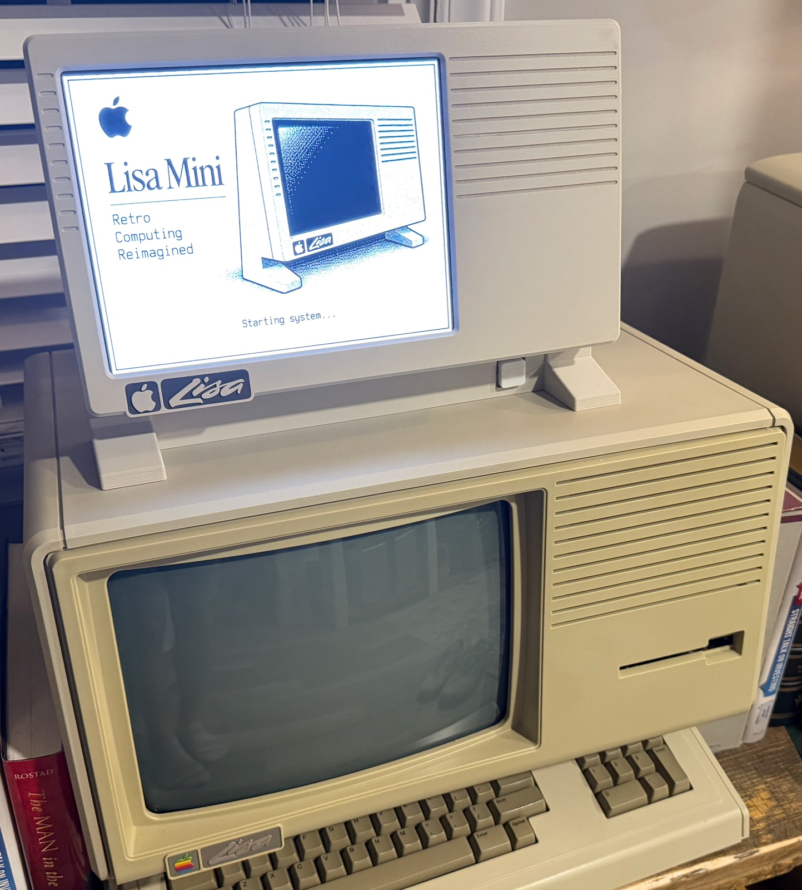
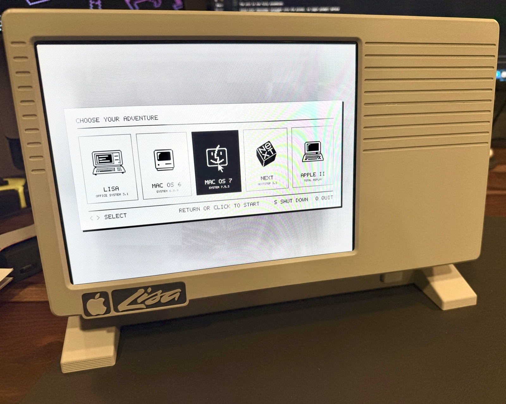
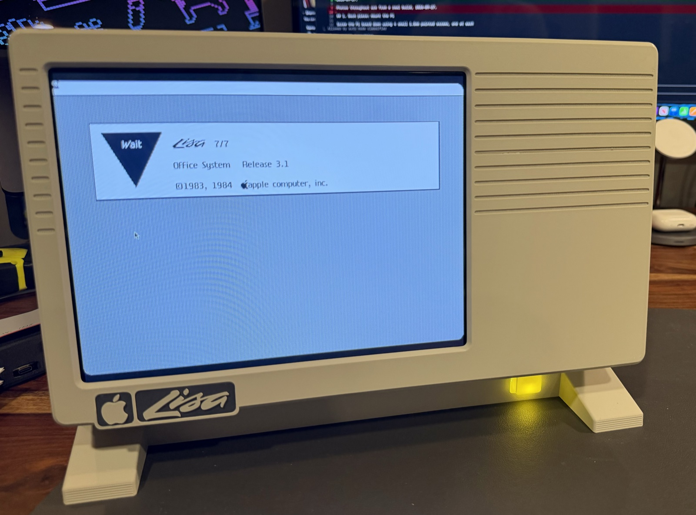
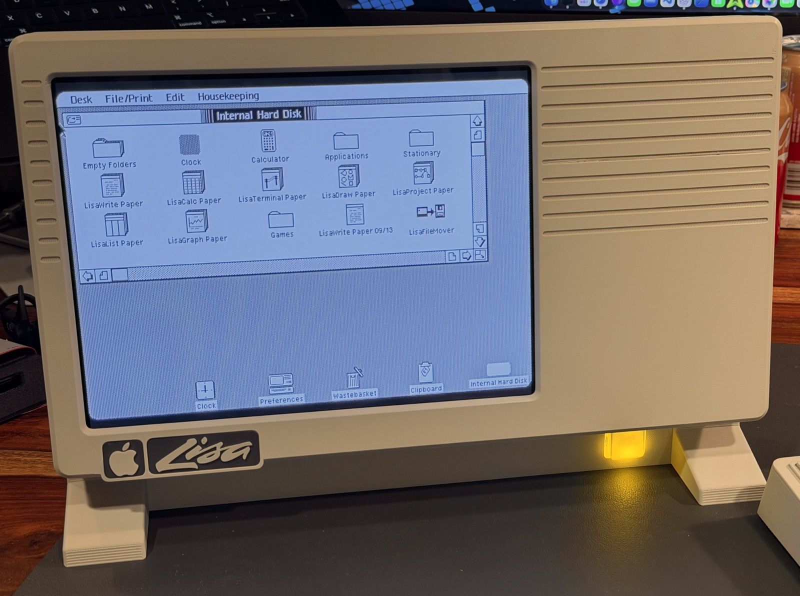
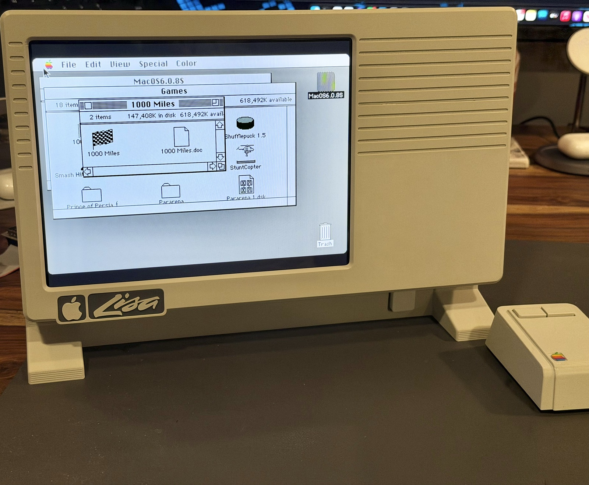
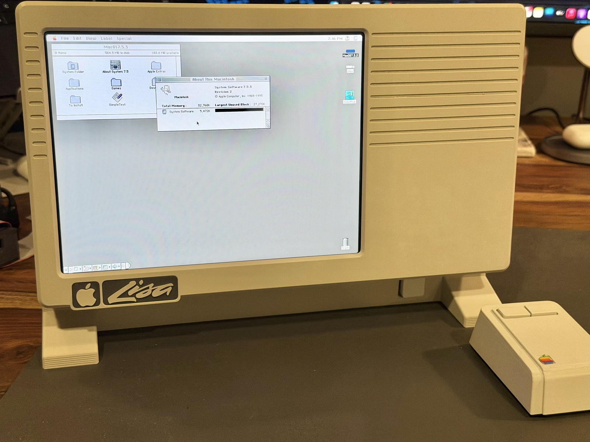
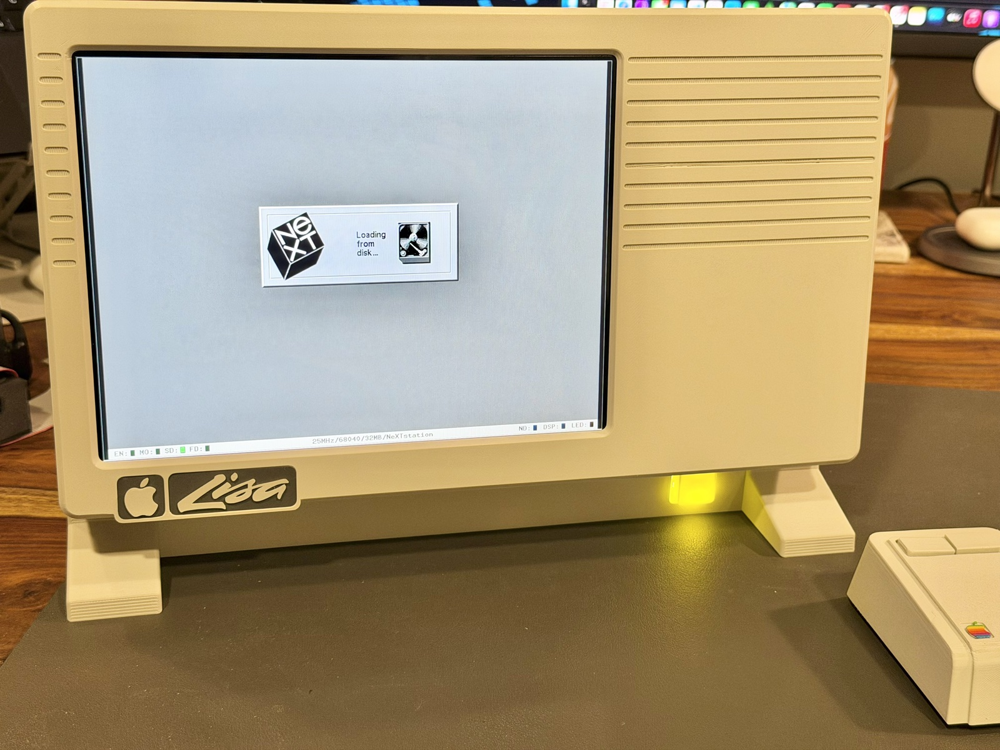
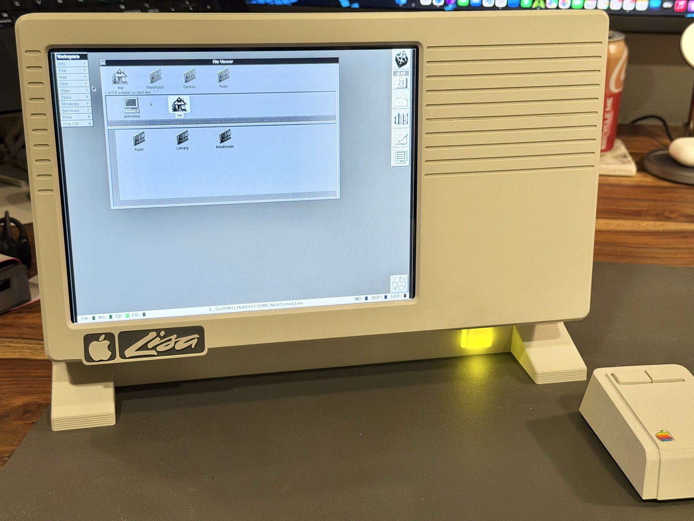
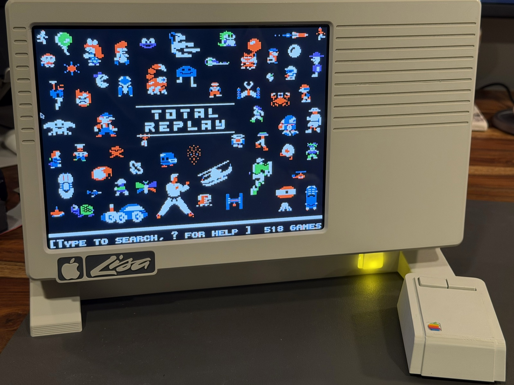

# Lisa Mini Pi



A Raspberry Pi in a 3D-printed Apple Lisa-shaped case with a 1024x768 HDMI
LCD panel, booting straight into a "CHOOSE YOUR ADVENTURE" kiosk launcher
that lets you pick which vintage system to run:

- **Apple Lisa** — Office System 3.1, via a patched `LisaEm`
- **Classic Mac OS 6** — via Mini vMac
- **Classic Mac OS 7** — via Basilisk II
- **NeXTSTEP 3.3** — via Previous
- **Apple II** — via LinApple, boots straight into Total Replay (a
  ready-to-play library of Apple II games)

A physical GPIO power button + LED are wired up for the systems that
support a clean button-triggered shutdown (Lisa, NeXT, Apple II) — see
`docs/software-setup.md` §2.

## Screenshots

All on real hardware, 2026-09-27.










## Controls

At the picker: arrow keys or mouse hover to select, Return or click to
launch. Once inside an emulator, shut it down from the guest OS itself
(or the physical power button, where wired) to return to the picker.

- **SHUT DOWN** (`S`, or click its footer text) and **QUIT** (`Q`, or
  click its footer text, which switches to the full Raspberry Pi Desktop)
  both open a confirmation dialog first — too disruptive to fire on a
  single accidental key/click. Confirm with Return or by clicking
  CONFIRM; cancel with Escape or by clicking CANCEL.
- **Reboot** (`R`) is a hidden shortcut — not shown in the footer, and
  runs immediately with no confirmation.
- Escape/Ctrl+C don't get you out of the kiosk — none exist by design.

## Project status: work in progress

**Hardware support**: the full software stack (all five emulators, the
kiosk launcher, `provision.sh`) has been fully tested end-to-end on both
a Pi 3 and a Pi 5, in addition to the **Pi 4, which remains the
recommended target**. Where the other two currently fall short:

- **Pi 3**: works, but emulator performance is noticeably worse,
  especially Previous and LinApple - see
  `software/lisa-pi-launcher/CLAUDE.md` for specifics.
- **Pi 5**: the software side is fully working, but the current
  3D-printed case has no mounting for the dedicated power board a Pi 5
  needs to be powered reliably through the GPIO header (a plain
  12V→5V buck converter, fine for a Pi 4, isn't a reliable power source
  for a Pi 5) - full physical Pi 5 support is pending a case revision
  that adds that mounting.

The case, hardware choices, and software here all still reflect one
specific build (Pi 4, iPad 1/2 LCD panel, 1024x768) otherwise. Nothing
about that is locked in - expect breaking changes to the hardware and/or
software as these are explored:

- **An iPad 3/4 LCD panel + a Pi 5 dual-power board**, together (not
  separately) — specific parts already in hand as of 2026-09-27, not yet
  built. Higher resolution than the current iPad 1/2 panel, and since the
  new panel's driver board runs on 5V rather than 12V, this combination
  could also drop the current external 12V→5V buck converter entirely -
  a separate, nicer-to-have bonus on top of (not a substitute for) the
  Pi 5 power-board case mounting noted above, which a future case
  revision needs regardless of which LCD panel it ends up paired with.
  See `hardware/assembly/README.md`'s "Future revision being explored"
  section for the parts and reasoning.
- **An 11.6" widescreen LCD front panel**, which would need real
  software changes (the launcher's whole layout is currently hardcoded
  for a fixed 1024x768 4:3 panel - see `theme.py`'s docstring) to fit
  the Pi's actual display area into a widescreen opening correctly,
  not just a case redesign.

If you're building from this repo today, assume the specific
combination it documents (case STLs, BOM, `provision.sh`, the 1024x768
picker layout) rather than the abstract idea of "a Lisa Mini Pi" - any
of it may shift under a future build.

## Setting up a new Pi

```
git clone https://github.com/wottle/lisa-mini-pi.git ~/lisa-mini-pi
~/lisa-mini-pi/scripts/provision.sh
```

Automates everything installable without copyrighted assets - every
emulator build/install, the kiosk launcher, GPIO/LED wiring setup,
systemd units, and the boot splash. **There's no pre-packaged SD card
image**: every emulator needs a ROM and/or OS disk image that this
project has never redistributed (see "not redistributed here"
throughout `docs/software-setup.md`) - baking those into a public image
would be a real copyright problem. `provision.sh` prints exactly which
files to place where once it's done; read it before running it, like
any script that calls `sudo`.

## Layout

- `hardware/3d-models/` — case/enclosure STL files, print quantities, and
  the two back-piece variants (with/without a physical power button).
- `hardware/bill-of-materials.md` — everything else needed to build one:
  the Pi, LCD panel, power supply, switch, LED, wiring.
- `hardware/assembly/` — build/assembly instructions (placeholder, not yet populated).
- `scripts/provision.sh` — automates the software setup below on a fresh
  Pi; see "Setting up a new Pi" above.
- `software/lisa-pi-launcher/` — the kiosk launcher (Python), including the
  GPIO power-button/LED scripts and the systemd units that run it on boot.
- `docs/software-setup.md` — end-to-end setup guide: building the patched
  LisaEm, installing every emulator, wiring the physical power
  button/LED, the boot splash, and the boot-time systemd setup.
- `software/lisa-pi-launcher/SETUP.md` — a second, older setup doc
  covering the launcher/LisaEm/Basilisk II/Mini vMac in more detail; it
  does not cover Previous or LinApple (see the note at its top).

## Related repos

- [`wottle/lisaem`](https://github.com/wottle/lisaem) (branch
  `lisa-fixes-1024x768`) — patched fork of `arcanebyte/lisaem` used for the
  Apple Lisa environment. See `docs/software-setup.md` for what's patched
  and why.
